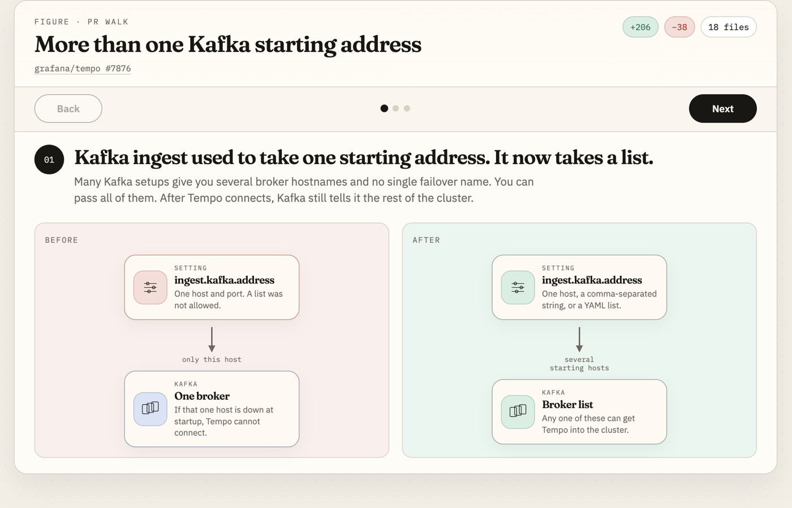
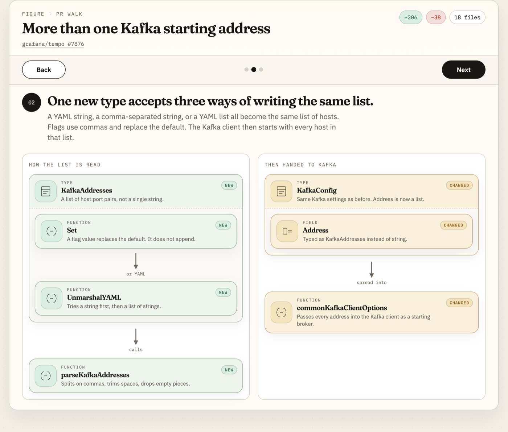
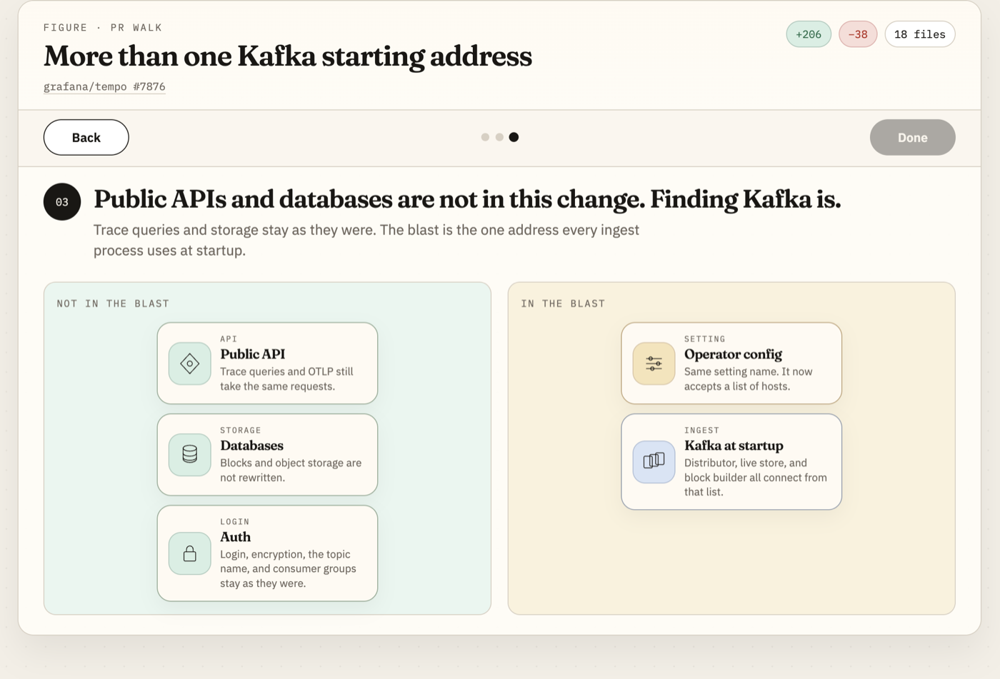

# Figure

A visual language for explaining pull requests. **One CSS file, one small JS file for the ask-prompt box. No npm, no build.**

A coding agent emits a **short walk** of the PR (a few scenes, one claim each). Click a component, type a question, copy a preconstructed prompt back into the agent.

`figure.css` inlines Fraunces, IBM Plex, and the glyph icons. `figure.js` only fills the question box and copy button.

## A walk

Three scenes from [grafana/tempo #7876](walks/tempo-kafka-brokers.html). Typical shape: what changed, how it works, blast as hit vs not-hit.

**01 · What changed**



**02 · How it works**



**03 · Blast radius**



## Open it

Double-click `index.html`, or File → Open in a browser. Nothing to install. Do not start a server.

## Skill

Load `skills/explain-pr/SKILL.md`. Copy `figure.css` and `figure.js` next to the HTML the model emits. The component palette is `catalog.html`.

## Walkthroughs

| Page | PR |
|------|----|
| [walks/tempo-kafka-brokers.html](walks/tempo-kafka-brokers.html) | [grafana/tempo #7876](https://github.com/grafana/tempo/pull/7876) |
| [walks/mimir-blocks-admin.html](walks/mimir-blocks-admin.html) | [grafana/mimir #16549](https://github.com/grafana/mimir/pull/16549) |
| [walks/react-compiler.html](walks/react-compiler.html) | [react/react #36173](https://github.com/facebook/react/pull/36173) |
| [walks/vite-environments.html](walks/vite-environments.html) | [vitejs/vite #16471](https://github.com/vitejs/vite/pull/16471) |
| [walks/next-ppr.html](walks/next-ppr.html) | [vercel/next.js #69282](https://github.com/vercel/next.js/pull/69282) |
| [walks/tailwind-oxide.html](walks/tailwind-oxide.html) | [tailwindlabs/tailwindcss #19632](https://github.com/tailwindlabs/tailwindcss/pull/19632) |

## Rebuild the stylesheet

```bash
python3 scripts/build-css.py
```
